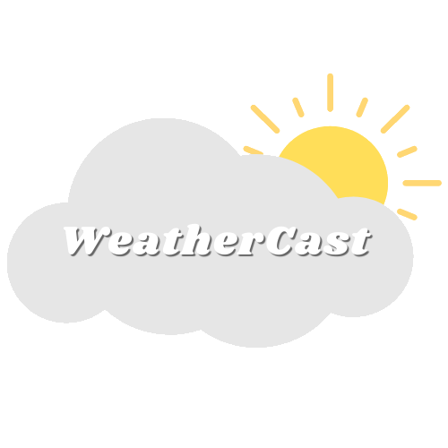

<div align=center>
    
</div>

<div align=center>
	<a href="https://weathercastt.netlify.app/" target="_blank">Check the Website</a>
</div>

<p align=center>
 WeatherCast is a weather website that allows it's users to check any city's weather, with precise weather details.
</p>

<p align="center">
 <a href="#camera-demonstration">Demonstration</a> •
 <a href="#gear-features">Features</a> •
 <a href="#electric_plug-technologies">Technologies</a> •
 <a href="#computer-instalation">Instalation</a> •
 <a href="#raising_hand_man-author">Author</a> 
</p>

## :camera: Demonstration

<div align=center>
    
    
    
    
</div>

## :gear: Features
- [X] Search the weather by the city's name;
- [X] Show the city's weather;
- [X] Show humidity, wind pressure, cloud porcentage, etc. 
- [X] Change theme color


## :electric_plug: Technologies
* [React](https://pt-br.reactjs.org/)
* [React Switch](https://www.npmjs.com/package/react-switch/)
* [React Spring](https://react-spring.io/)
* [TypeScript](https://www.typescriptlang.org/)
* [Axios](https://www.npmjs.com/package/axios/)
* [Styled Components](https://styled-components.com/)
* [OpenWeatherApi](https://openweathermap.org/)

## :computer: Instalation
```bash
// First clone the repository
$ git clone http://github.com/SitaGomes/WeatherCast

// Them go to the project folder
$ cd WeatherCast

// Install all the dependencies
$ npm install

// Run the project and 
$ npm start

```

## :raising_hand_man: Author

Created with ♥ by Arthur Gomes, let's chat!

<a href="https://twitter.com/ArthurSitaGomes" title="Image from freepnglogos.com">

</a>

<a href="https://linkedin.com/in/arthur-sita-gomes-3683221b3/" title="Image from freepnglogos.com">

</a>
